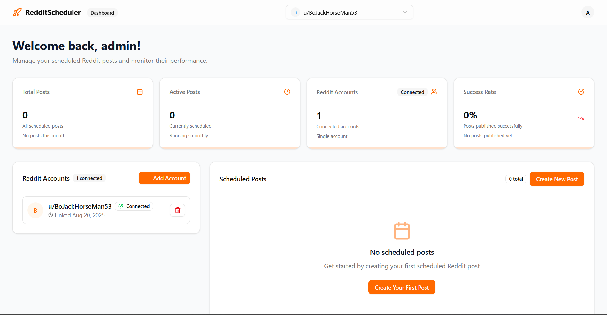

# Schedularr 🚀

A powerful, cloud-native web application that enables users to schedule Reddit posts with advanced recurring patterns and multi-account support. Built with Django REST Framework and React TypeScript.



## ✨ Features

### Core Functionality
- **📅 Flexible Scheduling**: One-time or recurring posts with cron expressions
- **🔄 Multi-Account Support**: Connect and manage multiple Reddit accounts
- **⚡ Real-time Dashboard**: Monitor scheduled posts and account status
- **🔐 Secure OAuth**: Reddit OAuth2 integration with encrypted token storage
- **📊 Post Analytics**: Track submission history and success rates

### Advanced Features
- **🎯 Smart Retry Logic**: Intelligent error handling with exponential backoff
- **🚦 Status Management**: Real-time post status tracking (active, queued, completed, error)
- **📋 Intuitive UI**: Modal-based post creation and editing
- **🌐 Responsive Design**: Mobile-friendly interface with modern design
- **⏰ Timezone Aware**: Proper timezone handling for global users

## 🏗️ Architecture

**Backend (Django + Celery):**
- Django REST API with JWT authentication
- PostgreSQL database for data persistence
- Celery workers for background post processing
- Celery Beat scheduler for recurring tasks
- Redis as message broker and cache

**Frontend (React + TypeScript):**
- Modern React with TypeScript and Vite
- Shadcn/UI components with Tailwind CSS
- React Router for navigation
- Axios for API communication
- Context-based state management

**Infrastructure:**
- Docker containerization with microservices architecture
- Nginx reverse proxy for production
- Horizontal scaling support for workers
- Health checks and service monitoring

## 🚀 Quick Start

### Prerequisites
- Docker and Docker Compose
- Reddit API credentials ([Get them here](https://www.reddit.com/prefs/apps))

### Development Setup

1. **Clone the repository:**
```bash
git clone https://github.com/kneelesh48/schedularr
cd schedularr
```

2. **Set up environment variables:**
```bash
cp backend/.env.example backend/.env
# Edit backend/.env with your Reddit API credentials
```

3. **Start development services:**
```bash
# Backend (Django + Celery)
cd backend
uv run manage.py migrate
uv run manage.py runserver

# Run Celery worker in another terminal
uv run celery -A backend worker --loglevel=info

# Run Celery beat in another terminal
uv run celery -A backend beat --loglevel=info

# Frontend
cd frontend
npm install
npm run dev
```

4. **Access the application:**
- Frontend: http://localhost:5173
- Backend API: http://localhost:8000
- Admin Panel: http://localhost:8000/admin
- Swagger UI: http://localhost:8000/api/schema/swagger-ui/

### Production Deployment

1. **Configure environment:**
```bash
cp backend/.env.example backend/.env
# Update with production values
```

2. **Deploy with Docker:**
```bash
docker-compose up -d

# Apply database migrations
docker-compose exec web uv run python manage.py migrate

# Create superuser (optional)
docker-compose exec web uv run python manage.py createsuperuser
```

3. **Access production app:**
- Application: http://localhost:8080

> 📋 **For detailed production operations, scaling, and maintenance procedures, see [DEPLOYMENT.md](DEPLOYMENT.md)**

## 🛠️ Configuration

### Environment Variables

Key configuration options in `backend/.env`:
Check [backend/.env.example](backend/.env.example)

## 📋 Usage

### Creating Scheduled Posts

1. **Connect Reddit Account**: Link your Reddit account via OAuth
2. **Create Post**: Use the dashboard to create a new scheduled post
3. **Set Schedule**: Use cron expressions for flexible scheduling:
   - `0 9 * * *` - Daily at 9 AM
   - `0 9 * * 1` - Weekly on Mondays at 9 AM
   - `0 9 1 * *` - Monthly on 1st at 9 AM

### Managing Multiple Accounts

- Connect multiple Reddit accounts per user
- Switch between accounts in the dashboard
- Each post is tied to a specific Reddit account
- Account health monitoring and status tracking

### Monitoring Posts

- Real-time dashboard with post status
- Submission history and error tracking
- Success rate analytics
- Detailed error messages and retry status

## 🔧 Development

### Backend Structure
```
backend/
├── backend/           # Django project settings
├── reddit/            # Main app with models, tasks, views
├── users/             # User management
└── manage.py
```

### Frontend Structure
```
frontend/
├── src/
│   ├── components/    # Reusable UI components
│   ├── pages/         # Page components
│   ├── services/      # API and utility services
│   ├── hooks/         # Custom React hooks
│   ├── context/       # React context providers
│   └── types/         # TypeScript type definitions
└── public/
```

## 🧪 Testing

```bash
# Backend tests
cd backend
uv run python manage.py test

# Frontend tests
cd frontend
npm run test

# Linting
npm run lint
```

## 📊 Scaling

### Horizontal Scaling
```bash
# Scale workers for high load
docker-compose up -d --scale worker=5

# Scale web servers
docker-compose up -d --scale web=3
```

### Monitoring
```bash
# View service logs
docker-compose logs -f worker
docker-compose logs -f web

# Health check status
docker-compose ps
```

## 🔒 Security

- **OAuth2 Flow**: Secure Reddit authentication with CSRF protection
- **Token Encryption**: Reddit refresh tokens stored encrypted
- **Input Validation**: Comprehensive validation on all inputs
- **Rate Limiting**: Built-in Reddit API rate limiting compliance
- **Environment Variables**: Sensitive data in environment variables only

## 🤝 Contributing

1. Fork the repository
2. Create a feature branch: `git checkout -b feature/new-feature`
3. Commit changes: `git commit -am 'Add new feature'`
4. Push to branch: `git push origin feature/new-feature`
5. Submit a Pull Request

## 📄 License

This project is licensed under the MIT License - see the [LICENSE](LICENSE) file for details.

## 🗺️ Roadmap

- [ ] Calendar view with drag-and-drop scheduling
- [ ] Post templates and content suggestions
- [ ] Advanced analytics and reporting
- [ ] Webhook notifications
- [ ] Mobile app (iOS/Android)
- [ ] Team collaboration features
- [ ] AI-powered posting optimization

---

**Built with ❤️ using Django, React, and modern DevOps practices.**